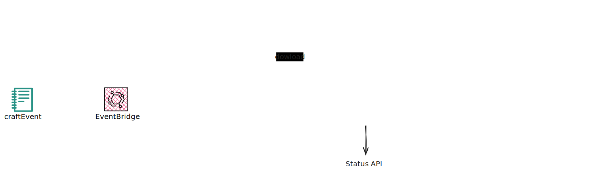

<p align="center">
  
  <h3 align="center">craft</h3>
  <p align="center"><strong>Orchestration of serverless (aws cdk) applications for SaaS</strong></p>

  <p align="center">
    <!-- Documentation -->
    <a href="https://pkg.go.dev/github.com/fogfish/craft">
      
    </a>
    <!-- Build Status  -->
    <a href="https://github.com/fogfish/craft/actions/">
      
    </a>
    <!-- GitHub -->
    <a href="http://github.com/fogfish/craft">
      
    </a>
    <!-- Coverage -->
    <a href="https://coveralls.io/github/fogfish/craft?branch=main">
      
    </a>
  </p>
</p>

---

The application defines AWS CDK solution for serverless (aws cdk) applications orchestrations in the context of SaaS development. It builds AWS Cloud infrastructure and services for management of cloud resources as response to "business events".


## Inspiration

Building SaaS (Software as a Service) requires the on-demand provisioning of cloud resources to ensure scalability, reliability, and cost-efficiency. We found that using Serverless and AWS CDK enable a new paradigm for building SaaS architectures by simplifying resource management and deployment processes. Serverless technology allows for automatic scaling and efficient utilization of resources, while AWS CDK provides a streamlined way to define and provision infrastructure using familiar programming languages. This combination enhances agility, reduces operational overhead, and facilitates the rapid development of customized, tenant-specific environments.

In the context of SaaS development, deployment rules differ from traditional software where merging a pull request typically triggers CI/CD pipelines. Instead, SaaS deployment often requires additional considerations such as tenant isolation, dynamic resource allocation, and multi-tenant support, which necessitate more sophisticated and flexible deployment strategies. For example, in single-tenant SaaS architectures, deployment is often triggered by specific business events such as subscriptions, registrations, or payments. These events necessitate the provisioning and configuration of dedicated resources for each tenant, ensuring tailored and secure environments.

Here, we have developed serverless solution for deploying SaaS architecture components through simplified resource management and deployment processes upon "business events". 

Security is a primary concern for us, especially given [the high risks associated with CI/CD pipelines](https://cheatsheetseries.owasp.org/cheatsheets/CI_CD_Security_Cheat_Sheet.html#understanding-cicd-risk) in deploying SaaS components. While CI/CD offers logical efficiency and automation for this tasks, it also introduces vulnerabilities that must be meticulously managed to safeguard sensitive data and maintain system integrity. The isolation of tenant deployments mitigates these risks.




## Getting started

The application is fully functional serverless application that uses Golang and AWS CDK, which is deployed as-is into your cloud environment. The latest version of the construct is available at its `main` branch. All development, including new features and bug fixes, take place on the `main` branch using forking and pull requests as described in contribution guidelines.

Use `cdk` to deploy the application into production, it only require name of S3 bucket to be used for storage of aws cdk templates.

```bash
cdk deploy -c source-code=my-s3-bucket

# ...

 ✅  craft-main

✨  Total time: 79.66s
```

Note: Docker is required for building and running the solution because the AWS CDK uses it for automat assemble of assets. Use colima on MacOS.


## Interfaces

The solution implements two type of interfaces implemented over AWS S3 (1) for definition of cloud resource templates and (2) for business events. 

### Access Management

The access management is controlled by AWS IAM thought definition of permissions to provisioned S3 bucket.

### (1) Templates

The template is AWS CDK application tailored for your needs, implemented on any supported language. See example of [minimalistic template](./examples/template/).
Upload templates into S3 bucket where they be served.

```bash
aws s3 cp examples/template s3://my-s3-bucket/github.com/fogfish/craft/examples/template --recursive
```

### (2) Events

The event is JSON object that should be compliant to [schema](./internal/events/events.go). Clients writes JSON object into S3 bucket to trigger the crafting job.

```bash
echo '{
  "uid": "123-456-789",
  "module": "github.com/fogfish/craft/examples/template",
  "context": {
    "acc": "demo"
  }
}' > demo.craft.event.json

aws s3 cp demo.craft.event.json s3://my-s3-bucket/demo.craft.event.json
```

Note: unique event id (`uid`) allows to follow up the deployment status using AWS Batch ListJobs API: 

```bash
aws batch list-jobs --job-queue craft-vX --filters name=JOB_NAME,values=123-456-789
```


# FAQ

## Why not use standard CI/CD?

Our solution decouples the deployment pipelines of software components from tenant-specific feature provisioning. Utilizing GitHub Actions as the primary CI/CD tool presents challenges in maintaining proper isolation between code and configuration.

## Why not use AWS CodeBuild?

Currently, AWS CodeBuild offers EC2 and Lambda as compute environments. EC2 is relatively slow in provisioning resources, whereas Lambda's 15-minute execution limit is often insufficient for handling all edge cases.

## What are the advantages of AWS Batch?

AWS Batch supports Fargate and allows the use of spot instances, offering a robust "serverless" approach for building compute environments. It simplifies the configuration of containers for job definitions and enables the submission of orchestration jobs through queue-like interfaces. This solution is highly scalable and suitable for any type of job required for running SaaS applications.


## How To Contribute

The library is [MIT](LICENSE) licensed and accepts contributions via GitHub pull requests:

1. Fork it
2. Create your feature branch (`git checkout -b my-new-feature`)
3. Commit your changes (`git commit -am 'Added some feature'`)
4. Push to the branch (`git push origin my-new-feature`)
5. Create new Pull Request


### commit message

The commit message helps us to write a good release note, speed-up review process. The message should address two question what changed and why. The project follows the template defined by chapter [Contributing to a Project](http://git-scm.com/book/ch5-2.html) of Git book.

### bugs

If you experience any issues with the library, please let us know via [GitHub issues](https://github.com/fogfish/craft/issue). We appreciate detailed and accurate reports that help us to identity and replicate the issue. 

## License

[](LICENSE)
